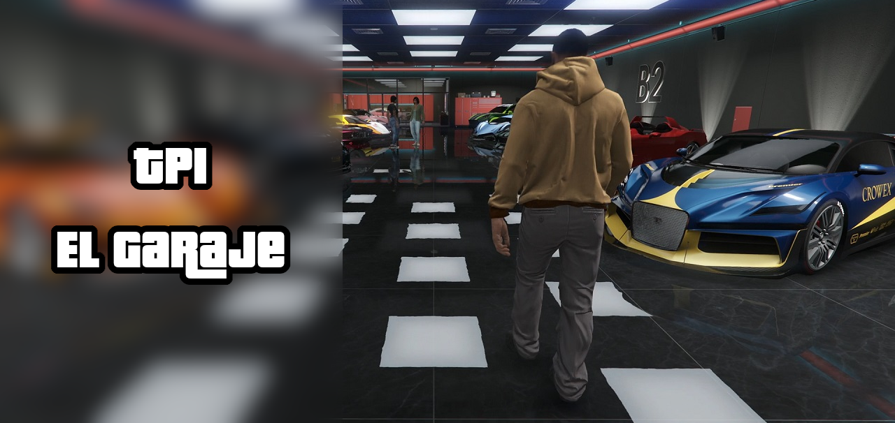

# TPI - 2c2025 - El Garaje

<p align="center">
   <br>
</p>

El proyecto está configurado usando [Maven](https://maven.apache.org/),
y puede ser compilado, empaquetado y probado fácilmente usando los siguientes comandos:

### Compilar

```
mvn compile
```

### Empaquetar

```
mvn package
```

### Pruebas

```
mvn test
```

## Aclaraciones para el corrector

Si necesitan aclarar o justificar alguna decisión de implementación,
lo pueden hacer escribiendo en esta sección del README.